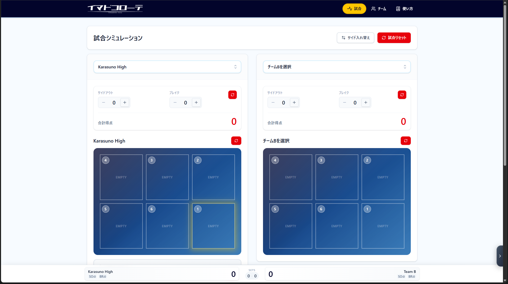

# Imadoko Remake (Volleyball Rotation Manager)

> **From "Hackathon MVP" to "Engineering Product".**
> 5日間の初期学習から3ヶ月の時を経て、堅牢性・保守性・UXを極限まで高めたバレーボールローテーション管理システム。

 

## 📖 Context & Story

このプロジェクトは、プログラミング学習開始5日目に作成した処女作「[imadoko-rotate](https://github.com/MaryCache/imadoko-rotate)」を、3ヶ月後に「実務水準の設計思想」でフルスクラッチ（リメイク）したものです。

v1では「動くこと」を最優先しましたが、v2では「壊れないこと（堅牢性）」「変更しやすいこと（保守性）」「使いやすいこと（UX）」を主眼に置き、アーキテクチャを根本から刷新しました。

---

## 🚀 Key Evolution (v1 vs v2)

3ヶ月間の技術的な成長と、アーキテクチャの進化の比較です。

| Feature | v1 (The MVP) | v2 (The Engineering) |
| :--- | :--- | :--- |
| **Concept** | 5日間の成果物 | 3ヶ月の学習に基づく設計 |
| **Frontend** | React (Vite) / HTML5 DnD | Next.js 16 (App Router) / @dnd-kit |
| **Backend** | Spring Boot 2.7 (Java 17) | Spring Boot 3.2 (Java 21) / Docker |
| **Architecture** | Fat Controller / 密結合 | Layered Arch / Feature-based / SSOT |
| **Data Safety** | SQLite (再起動で消失) | PostgreSQL (Managed) / LocalStorage Guard |
| **Type Safety** | 手動定義 / `any`の温床 | OpenAPI Generator / Zod / Strict Mode |
| **UX** | PCのみ (スマホ操作不可) | 完全レスポンシブ / タッチデバイス対応 |

---

## 🏗️ Technical Highlights

### 1. Robust UX with `@dnd-kit` (Frontend)
v1で使用したネイティブHTML5 Drag & Drop APIは、モバイルブラウザでのタッチ操作に対応していないという致命的な欠陥がありました。
v2では **`@dnd-kit`** を採用し、以下の課題を解決しました。

*   **Mobile First:** タッチデバイスでのドラッグ操作を完全サポート。
*   **Accessibility:** キーボード操作やスクリーンリーダーへの配慮。
*   **Animation:** **Framer Motion** と組み合わせ、物理法則に基づいた直感的なレイアウトアニメーションを実現。

### 2. Defensive Error Handling (Backend/Fullstack)
「エラーで画面が止まる」ことを防ぐため、厳格なエラーハンドリング基盤を構築しました。

*   **Unified Error Response:** バックエンド（Spring Boot）の例外を `GlobalExceptionHandler` で捕捉し、統一されたJSONフォーマット（Code, Message, Details）で返却。
*   **Type-Safe Client:** フロントエンドに抽象化された `apiClient` を実装し、APIエラーを型安全な `ApiError` オブジェクトとしてハンドリング。
*   **User Feedback:** エラーコード（`E102: Conflict` 等）に基づき、ユーザーに具体的な解決策をToast通知で提示。

### 3. Crash-Proof Persistence (Data Integrity)
v1運用時に発生した「RenderのスリープによるSQLiteデータ消失事故」を教訓に、永続化層を強化しました。

*   **Infrastructure:** 本番DBに **Managed PostgreSQL** を採用し、データの永続性を保証。
*   **Local Resilience:** ブラウザ保存（LocalStorage）において、データ構造のバージョン管理と自動修復ロジック（Graceful Degradation）を実装。

### 4. Schema-Driven Development (DX)
**OpenAPI 3.0** をSSOT（Single Source of Truth）として定義し、バックエンドの実装とフロントエンドの型定義を自動生成・同期させています。これにより、インターフェース不整合によるバグを開発段階で排除しました。

---

## 🛠️ Tech Stack

### Frontend
*   **Framework:** Next.js 16 (App Router)
*   **Language:** TypeScript
*   **State Management:** React Hooks (Logic separation)
*   **UI Library:** Tailwind CSS 4, Headless UI
*   **Motion/DnD:** Framer Motion, @dnd-kit
*   **Testing:** Jest, Playwright, Storybook

### Backend
*   **Framework:** Spring Boot 3.2
*   **Language:** Java 21
*   **Database:** PostgreSQL (Prod), H2 (Test)
*   **API:** OpenAPI 3.0 (Schema First)
*   **Tools:** Docker Compose, Flyway (Migration), Maven

---

## 🏃‍♂️ Getting Started

### Prerequisites
*   Docker & Docker Compose
*   Node.js 18+
*   Java 21 (optional if using Docker)

### Quick Start (Docker)

```bash
# 1. Clone repository
git clone https://github.com/MaryCache/imadoko-remake.git
cd imadoko-remake

# 2. Start services (Backend, Frontend, DB, Swagger UI)
docker-compose up -d

# 3. Access
# - App: http://localhost:3000
# - API Docs: http://localhost:8081
```

### Manual Setup

<details>
<summary>Click to expand</summary>

#### Backend

```bash
cd imadoko_back

# 環境変数設定（本番DB接続など）
# application.properties で設定するか、環境変数で上書き
export SPRING_DATASOURCE_URL=jdbc:postgresql://localhost:5432/imadoko
export SPRING_DATASOURCE_USERNAME=postgres
export SPRING_DATASOURCE_PASSWORD=postgres

# アプリケーション起動
./mvnw spring-boot:run
```

#### Frontend

```bash
cd imadoko_front

# 環境変数設定
cp .env.local.example .env.local
# .env.local を編集してAPIのURLを設定
# NEXT_PUBLIC_API_URL=http://localhost:8080/api

# 依存関係インストールと起動
npm install
npm run dev
```

</details>

---

## 📚 Documentation

*   **API Spec:** [OpenAPI Schema](./openapi.yaml)
*   **Setup Guides:**
    *   [Render Deployment](./imadoko_back/RENDER_SETUP.md)
    *   [OpenAPI Setup](./imadoko_back/OPENAPI_SETUP_MANUAL.md)
    *   [Test Environment](./imadoko_back/TEST_SETUP_MANUAL.md)

---

## 🎯 Growth Analysis

リメイク前との詳細な比較は、[新旧比較ドキュメント](comparison.md)をご覧ください。

---

**Developed by MaryCache** - Seeking high-resolution structural understanding.